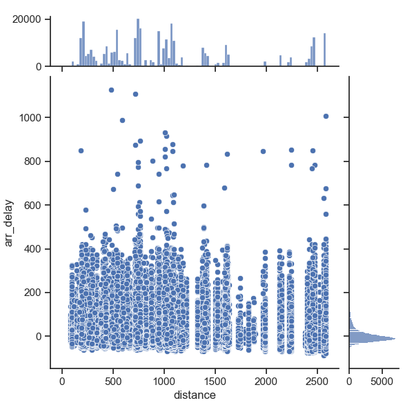

# hw-flights

## Goals:

* EDA with flights dataset
* Experience with SQLite
* Complex SQL queries

## Data

The [nycflights13](https://github.com/tidyverse/nycflights13) database is available in the
[rdata](https://github.com/ds5110/rdata/tree/main/data) repo both as a collection of CSV files 
and as a SQLite database: "mydb.sqlite".

## Story

Can you identify a robust relationship between arrival delay and distance in the nycflights13 dataset?

## Assignment

### Question 1

If you visualize the scatterplot of `arr_delay` and `distance` in the flights table, 
you'll notice a couple `distance` outliers.
Explain the source of these outliers, and remove them from the flights table. 
Then plot distance vs arr_delay using 
a [seaborn joint histogram](https://seaborn.pydata.org/examples/joint_histogram.html).
After filtering, describe the most interesting features relevant to the "story".
Keep your description to one or two sentences.

- The following make command to download the sqlite database file and execute the `q1.py` python file followed by the plots generated from the data.

```
make q1
```


- We can see outliers when distance exceeds 3000. When you closely examine, there are only 2 destinations (HNL and ANC) that are causing those outliers. So, I filtered the dataframe to remove these locations to get the data without outliers.



- In the joint plot, we can see that the distance is randomly distributed where are the arr_delay is normally distributed as we can see the bell curve on the margin plot.
- There are very few outliers for arr_delay as well but they don't seem to affect the distribution in any way. We can also see that no matter what the distance is, there is still arr_delay but the exact relation cannot be established.

### Question 2

Recall the central limit theorem, where the averaging of random data with arbitrary distributions
tends to reduce variance and create normally distributed averages.
Group the flights data by destination and average them. 
Produce a scatterplot that more clearly visualizes
a potential relationship between `arr_delay` and `distance.` 
Briefly explain your conclusion.


- The following make command to download the sqlite database file and execute the `q2.py` python file followed by the plot generated from the data.

```
make q2
```


- The plot is made with arr_delay as X-axis and distance as Y-axix. We can observe that the grouped data is normally distributed and more focused in the range [0,20] than the rest of arr_delay values.
- We can see that there are more scatter points when the distance is less (say distance < 1500 units). However, arr_delay is not affected as the delay is increasing. There are very few scatter points where arr_delay is greater than 30 units. And these points are the cases when distance is less than 2000. So, we can conclude that arr_delay is not being affected by distance in this data. Distance might increase the probability of other factors affecting the arr_delay but distance alone does not affect arr_delay.
- Other factors might be weather, the time of the year etc.

### Question 3

The following figure is from [Chapter 13 of R for Data Science](https://r4ds.had.co.nz/relational-data.html) 
by Hadley Whickam.


Given that the primary key for a table in a RDBMS must be unique and that you can use multiple fields as a key,
can the grayed fields in the flights table be used as a primary key for the flights table?
Write a short python program that reads flights.csv to demonstrate your answer.

- The following make command to download the sqlite database file and execute the `q3.py` python file.

```
make q3
```

- To check if the columns `year, month, day, hour, flight` can be together used as primary key, we need to find the distinct row values of these columns. If they match the number of rows in original data, then we can use these columns as primary key. I have used `groupby` to find number of distict rows (since column/s values grouped together will always have unique values). You can also select these columns, drop duplicates and check if the resulting rows match the original rows.
- The following is the output of the code written which helps us conclude that we cannot use these columns as a primary key.

```
Number of rows where primary key is id in flights table:  336776
Number of unique rows values for the given columns from the original data :  333831
Total duplicated rows:  5890
Number of rows of unique duplicate rows :  2945


The columns 'year', 'month', 'day', 'hour','flight' CANNOT BE USED as primary key as there are duplicate rows for these columns
``` 


### Question 4

Get a copy of the SQLite database in the rdata directory for the course.
Write two SQL queries -- one using a JOIN and the other using WHERE -- to produce the following:

* print the carrier, tail number, month and day for each flight
* order the results by these fields (in the order specified)
* get only those flights for which the plane is a made by "AIRBUS INDUSTRIE"
* get only the first 10 flights

The two queries should produce the same results. For your solution...

* Include the two queries in this README.md (using markdown for code).
* Include the results of the two queries in your README.md (also using markdown for code).

Solution:

- The following make command to download the sqlite database file and execute the `q4.py` python file.

```
make q4
```

Using JOINS:

```
Query:
-------------------------------------------------------------
SELECT f.carrier, f.tailnum, f.month, f.day, f.flight FROM flights f inner join planes p
on p.tailnum = f.tailnum where p.manufacturer = "AIRBUS INDUSTRIE"
order by f.carrier, f.tailnum, f.month, f.day limit 10

Output:
-------------------------------------------------------------
USING JOINS:
  carrier tailnum  month  day  flight
0      B6  N503JB      1    1       4
1      B6  N503JB      1    1      83
2      B6  N503JB      1    7      41
3      B6  N503JB      1    8       9
4      B6  N503JB      1   12     553
5      B6  N503JB      1   12     369
6      B6  N503JB      1   13     155
7      B6  N503JB      1   14     527
8      B6  N503JB      1   16     431
9      B6  N503JB      1   16     399
```

Using WHERE:

```
Query:
-------------------------------------------------------------

SELECT carrier, tailnum, month, day, flight FROM flights
where tailnum in (select tailnum from planes where manufacturer = "AIRBUS INDUSTRIE")
order by carrier, tailnum, month, day limit 10

Output:
-------------------------------------------------------------
USING WHERE:
  carrier tailnum  month  day  flight
0      B6  N503JB      1    1       4
1      B6  N503JB      1    1      83
2      B6  N503JB      1    7      41
3      B6  N503JB      1    8       9
4      B6  N503JB      1   12     553
5      B6  N503JB      1   12     369
6      B6  N503JB      1   13     155
7      B6  N503JB      1   14     527
8      B6  N503JB      1   16     431
9      B6  N503JB      1   16     399
```


